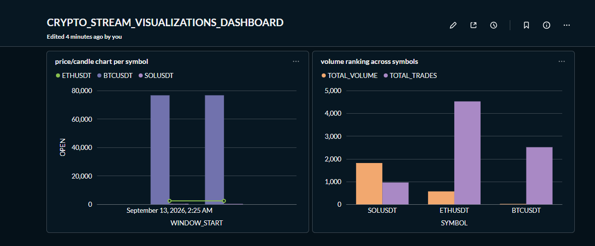

# crypto-stream

Real-time crypto trade data pipeline: Binance WebSocket → Kafka → S3 (lake) → Databricks Unity Catalog (lakehouse transforms) → Snowflake (warehouse) → dashboard.

## Why this exists

A learning project built to go deep on streaming ingestion, medallion architecture, grain and cardinality design, a real lake/lakehouse/warehouse separation, orchestration, and CI/CD, rather than another batch-only pipeline.

## Architecture

```
Binance WebSocket (trade stream)
        │
        ▼
   Kafka producer ──► Kafka topic (crypto-trades-raw)
                              │
                              ▼
                       Kafka consumer
                              │
                              ▼
                    S3 landing (raw JSON)  ◄── data lake
                              │
                     Databricks Auto Loader
                              │
                              ▼
              Unity Catalog: bronze (raw, trade grain)
                              │
                       dbt (dbt_task)
                              ▼
              Unity Catalog: silver (deduped, conformed)
                              │
                            dbt
                              ▼
      Unity Catalog: gold (dim_symbol, fact_trade, OHLC windows)
                              │
            load job (spark.sql → Snowflake, scheduled)
                              ▼
                    Snowflake  ◄── data warehouse
                              │
                              ▼
                 Metabase dashboard (candle chart + volume ranking)
```

Ingest → dbt transform → Snowflake load run as a single Databricks Workflow on a schedule, entirely on serverless compute (no classic clusters provisioned or managed).

## Data grain

- **Bronze**: one row per trade per symbol, as emitted by Binance.
- **Silver**: same grain, deduplicated (on trade ID, not price/timestamp — see `stg_trades.sql`) and type-conformed.
- **Gold**: `dim_symbol` (one row per trading pair), `fact_trade` (trade grain, partitioned by trade date), plus `fct_ohlc_1m` — rolling 1-minute OHLC/VWAP windows per symbol, a genuinely different grain from the trade-level fact table.

## Stack

- **Ingestion**: Python, `websockets`, Kafka
- **Lake**: AWS S3
- **Lakehouse / transforms**: Databricks, Unity Catalog, Delta Lake, dbt (native `dbt_task`)
- **Warehouse**: Snowflake
- **Orchestration**: Databricks Workflows, serverless compute throughout
- **IaC**: Terraform (AWS, Databricks Unity Catalog, Snowflake)
- **CI/CD**: GitHub Actions (lint + dbt build/test on PRs, isolated into `ci_silver`/`ci_gold` schemas so CI never touches live data), Databricks Asset Bundles for deployment

## Repo structure

```
producer/                      Binance WebSocket → Kafka
consumer/                      Kafka → S3 landing
notebooks/                     Auto Loader ingestion (bronze)
infra/
  main.tf, variables.tf, ...   S3, IAM (AWS)
  databricks/                  Unity Catalog: catalog + bronze/silver/gold schemas
  snowflake/                   Snowflake database + schema
dbt/crypto_stream_lakehouse/
  models/staging/silver/       stg_trades + source + schema tests
  models/marts/gold/           fct_trade, fct_ohlc_1m + schema tests
  seeds/                       dim_symbol.csv
  macros/                      get_custom_schema.sql (CI schema isolation)
warehouse/
  load_gold_to_snowflake.py    gold → Snowflake, via spark.sql + dbutils secrets
orchestration/
  databricks.yml               Asset Bundle root config
  resources/                   Job definition: ingest → dbt → Snowflake load
.github/workflows/
  ci.yml                       Lint + dbt build/test (isolated CI schemas)
  cd.yml                       Deploy bundle on merge to main
docker-compose.yml             Local Kafka + Kafka UI for development
```

## Status

End-to-end pipeline built and running: live trade ingestion, lake landing, Unity Catalog bronze/silver/gold, Snowflake warehouse load, a two-tile Metabase dashboard, and the full pipeline orchestrated on a schedule via Databricks Workflows with CI/CD in place.

Known simplifications:
- CI isolates data (separate schemas) but not compute — a CI run and the scheduled job share the same SQL warehouse.
- Dashboard reads batch-loaded Snowflake data on the job's schedule, not a live-updating view.

## Note on data

Live trade data is pulled from Binance's public market data WebSocket streams. No API key or authentication required for this data; used here for personal, non-commercial, educational purposes.